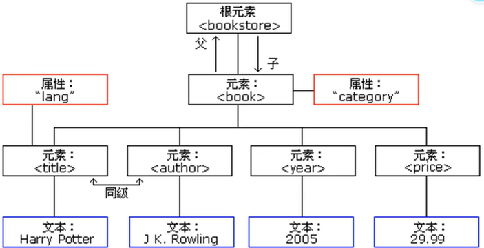
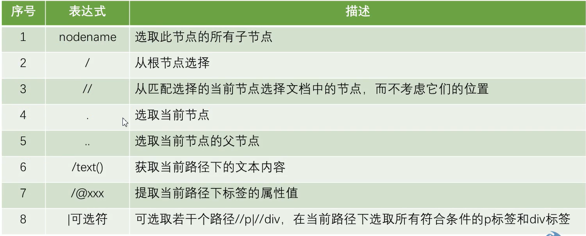
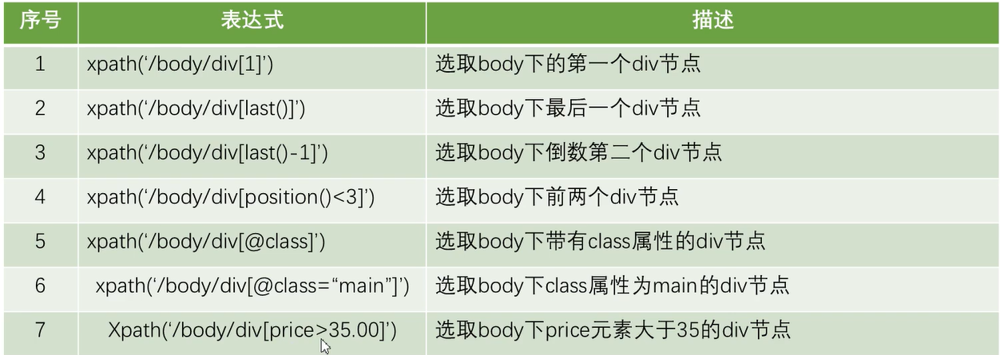
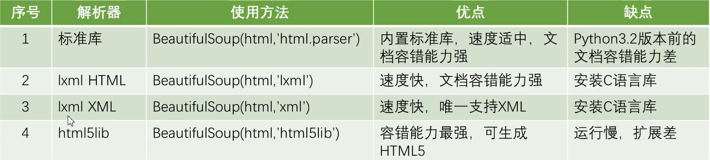
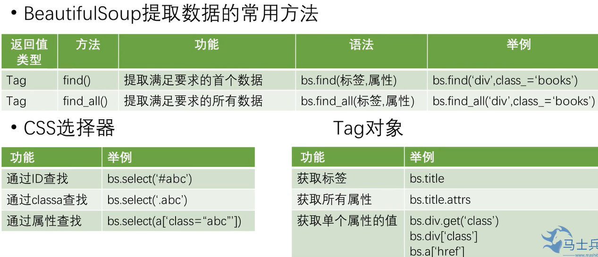
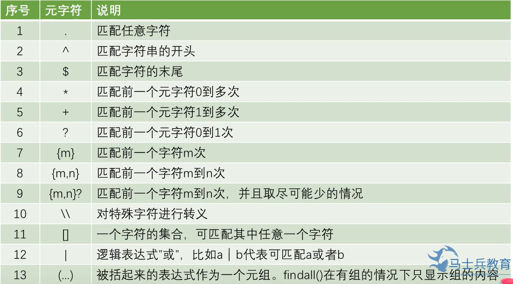
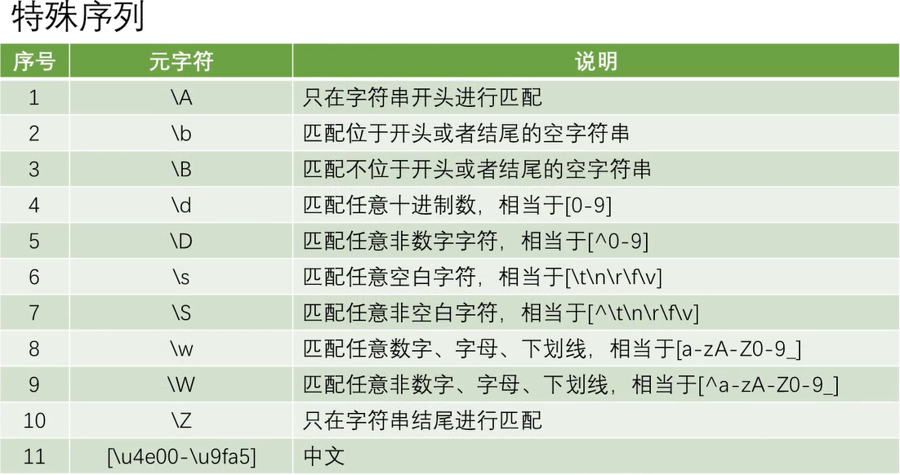
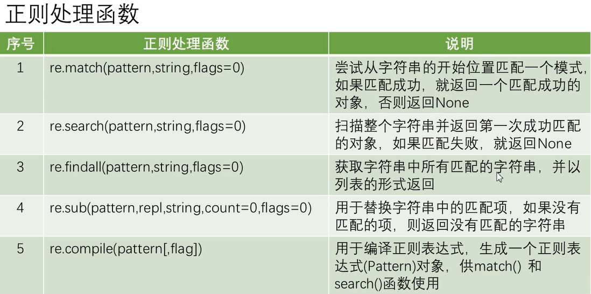
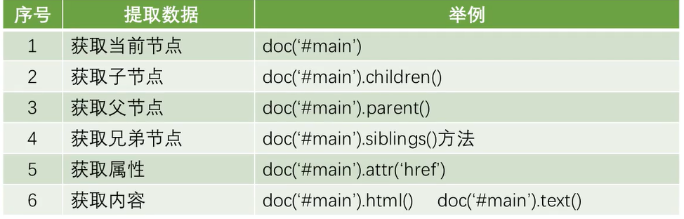
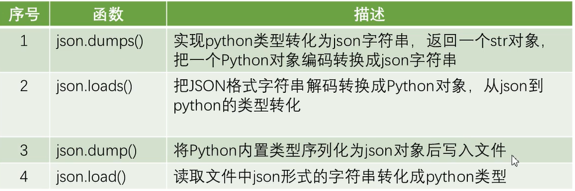

# Web Spider

## 1.简介

网址+"/robots.txt"查看应该遵守的约定文档(例如https://cn.bing.com/robots.txt )

### URL由6部分组成

用百度搜索数字1:
https://www.baidu.com/s?wd=1&rsv_spt=1&rsv_iqid=0xabb92c650005b595&issp=1&f=8&rsv_bp=1&rsv_idx=2&ie=utf-8&rqlang=&tn=baiduhome_pg&ch=&rsv_enter=1&rsv_btype=i&rsv_dl=ib&inputT=1188

1.协议类型(http协议端口:80,https协议端口:443)
2.主机名称/域名(www.baidu.com)
3.端口号(F12页面源代码->Network->Headers->远程地址:39.156.66.18:443)
4.查找路径(s就是查找路径)
5.查找参数(问号?之后的就是查询参数,使用键值对的方式,多个键值对之间用&连接,比如wd=1,wd就是搜索文本框的name,文本框的值就是1)
6.锚点(前端用来做面定位的,比如"某网址#3",搜索该网页中的第三部分,"某网址/#/friend",搜索网页中我的好友)

## 2.请求

### 请求方式

post请求:向服务器发送数据(登陆),上传文件等(请求参数放在form data中)
get:向服务器发送请求以获取数据

http协议中,向服务器发送一个请求,数据分为三部分,分别放在url/body/head中

### 常见请求头参数

user-agent:浏览器名称(用于判断是正常浏览器还是爬虫程序)
referer:表面当前请求是从哪个url过来的
cookie:由于http协议是无状态的,服务器不知道用户是第几次访问,所以需要在本地放置记录文件

### 响应码

200:请求正常
301:永久重定向(比如更换了新网址)
404:找不到url
418:服务器端反爬虫,拒绝响应
500:服务器内部错误

## 3.数据

### 静态/动态数据

**静态数据** 在服务器返回时已经完成,浏览器只需要解析,所以可以直接爬虫->Source/HTML

**动态数据** 在服务器返回时只有一个html框架,其数据需要通过json等数据形式填充,浏览器再把数据渲染到html中,所以爬虫时只能抓取到框架,抓不到数据->Ajax

### F12网页源代码

**Element:** 元素,网页HTML代码
**Console:** 控制台,输出一些警告提示信息
**Sources:** 整个网页需要的所有静态数据,除了HTML文件,还有JS,img文件等
**Network:** 显示页面时产生的所有请求.(其中XHR是Ajax请求)

### Session

Session代表服务器与浏览器的一次会话过程.服务器端的Session对象用来存储特定用户会话所需的信息,SessionID(无规律不重复的字符串)用来验证是否已登陆到账户(响应的Cookie中存储SessionID)

### Cookie

Cookie是由服务器端生成后发送给客户端的,并且总是保存在客户端本地(四大步骤:创建/设置存储/发送/读取Cookie)
请求时,headers包含Cookie,服务端从请求头中获取到Cookie.

### JSON

Json全称JavaScript Object Noation,即JS对象标记,这是一种轻量级的数据交互格式(仅仅用来存储数据,相当于JS的对象)
Json数据格式(形式上与python字典相似):对象标识为键值对,数据由逗号分隔,大括号保存对象,中括号保存数组
JSON在Python中分别由list和dict组成

### Ajax

Ajax在浏览器与服务器之间使用异步数据传输,这样可以使网页从服务器请求少量信息,而不是整个页面.
Ajax一般返回的是json文件,直接对ajax地址进行post/get,就可以返回json数据了
F12->Network->XHR即可查看Ajax数据,把其中的url地址放在浏览器地址栏中,可以看到ajax的json数据(可以登录json解析网站进行格式化)
如果在Source中找到了网页某部分信息则在HTML中,没找到则在Ajax中

## 4.urllib库

urllib是Python**自带**的标准库中用于网络请求的库,无需安装,直接引用即可
通常用于爬虫开发、API数据获取和测试

urllib库的4大模块:request,error,parse,robotparser

### urllib.request

用于打开和读取URL,模拟浏览器发起一个HTTP请求,并获取请求响应的结果

#### 发送get和post请求

语法格式:
`urlopen(url, data=None, [timeout,]*, cafile=None, capath=None,cadefault=False, context=None)`

参数说明:

**url:** 要访问的地址
**data:** 默认值为None,若参数data为None则代表请求方式get,反之请求方式为post.参数data以字典形式存储数据，并将参数data虽字典类型转换成字节类型能完成Post请求
urlopen函数返回的结果是一个http.client.HTTPResponse对象

```python
# urllib.request用于打开和读取URL,模拟浏览器发起一个HTTP请求,并获取请求响应的结果
# data为空,用Get请求
url = 'https://www.cnblogs.com/'
result = urllib.request.urlopen(url,timeout=3,) # urlopen打开请求
result_read = result.read().decode('utf-8') # read对返回结果进行读取,decode把bytes类型转成str类型
# print(result_read)

# data非空,用Post请求
data={'username':'111','password':'222','action':'login'}
resp = urllib.request.urlopen(url,data=bytes(urllib.parse.urlencode(data),encoding='utf-8'))
html = resp.read().decode('utf-8')
print(html)
```

#### 构造request对象并添加请求头headers发送请求

```python
url = 'https://www.cnblogs.com/'
headers = {'User-Agent':'Mozilla/5.0 (Windows NT 10.0; Win64; x64) AppleWebKit/537.36 (KHTML, like Gecko) Chrome/101.0.4951.54 Safari/537.36 Edg/101.0.1210.39'}
#构建请求对象:
req = urllib.request.Request(url, headers)
#使用urlopen打开请求
resp = urllib.request.urlopen(req)
html = resp.read().decode('utf-8')
print(resp)
```

#### IP代理

```python
# IP代理
from urllib.request import build_opener,ProxyHandler
#ProxyHandler({协议:IP地址:端口})
proxy = ProxyHandler({'http':'120.42.46.226:6666'})
opener = build_opener(proxy) # 用build_opener创建一个请求方法,替代urlopen
url = 'https://www.cnblogs.com/'
result = opener.open(url,timeout=3,) # urlopen打开请求
result_read = result.read().decode('utf-8') # read对返回结果进行读取
print(result_read)
```

#### 使用Cookie

实例化MozillaCookieJar(保存cookie),创建handler对象(cookie的处理器),创建opener对象,打开网页(发送请求获取响应),保存cookie文件

```python
#使用cookie
from urllib.request import build_opener,ProxyHandler
from http import cookiejar
def get_cookie(filename):
    #(1)实例化一个MozillaCookieJar(用于保存cookie)
    cookie = cookiejar.MozillaCookieJar(filename)
    #(2)创建handler对象
    handler = urllib.request.HTTPCookieProcessor(cookie)
    #(3)创建opener对象
    opener = urllib.request.build_opener(handler)
    #(4)请求网址
    url = 'https://www.baidu.com/'
    resp = opener.open(url)
    cookie.save(filename)

def use_cookie(filename):
    #(1)实例化一个MozillaCookieJar（用于保存cookie)
    cookie = cookiejar.MozillaCookieJar(filename)
    #(2)加载cookie.txt文件
    cookie.load(filename)
    print(cookie)

filename = 'D:/爬虫/cookie.txt'
get_cookie(filename)
use_cookie(filename)
```

### urllib.error

异常处理主要用到两大类:

**1.urllib.error.URLError:** 用于捕获由urllib.request产生的异常(请求的时候就出错了),使用reason属性返回错误原因

**2.urllib.error.HTTPError:** 用于处理HTTP与HTTPS请求的错误,它有三个属性:
(1)reason:返回错误的原因
(2)code:请求返回的状态码
(3)headers:请求返回的响应头信息

```python
import urllib.request,urllib.error
url = 'https://movie.douban.com/' # 或 url = 'https://www.google.com'
#请求
try: 
    resp = urllib.request.urlopen(url, timeout=3)
except urllib.error.URLError as e:
    print('原因:',e.reason)
try: 
    resp = urllib.request.urlopen(url, timeout=3)
except urllib.error.HTTPError as e:
    print('原因:',e.reason)
    print("响应状态码:",e.code)
    print("响应头数据:",e.headers)
```

### urllib.parse

```python
#urllib.parse(用于解析URL,将输入的地址栏URL中带中文的请求参数转换为%x%x%x)
import urllib.parse
kw={'wd':'汤姆'}
result_encode = urllib.parse.urlencode(kw)
print(result_encode)
result_decode = urllib.parse.unquote(result_encode)
print(result_decode)
```

### urllib.robotparser

用于解析robots.txt文件

## 5.requests库

### 基本概念

语法结构:`requests.get(url,params=None)`获取对象,该方法的结果为Respense对象,包含服务器的响应信息

<table>
  <tr>
    <th>方法</th>
    <th>描述</th>
  </tr>  
  <tr>
    <th>response.request(url)</th>
    <th>构造一个请求对象</th>
  </tr>  
  <tr>
    <th>response.get()</th>
    <th>发送Get请求</th>
  </tr>  
  <tr>
    <th>response.post()</th>
    <th>发送Post请求</th>
  </tr>  
  <tr>
    <th>response.head()</th>
    <th>获取HTML的头部信息</th>
  </tr>  
  <tr>
    <th>response.put()</th>
    <th>发送Put请求</th>
  </tr>  
  <tr>
    <th>response.patch</th>
    <th>提交局部修改请求</th>
  </tr>  
  <tr>
    <th>response.delete()</th>
    <th>提交删除请求</th>
  </tr>  
</table>

<table>
  <tr>
    <th>属性或方法</th>
    <th>描述</th>
  </tr>  
  <tr>
    <th>response.status_code</th>
    <th>响应状态码</th>
  </tr>  
  <tr>
    <th>response.content</th>
    <th>把response对象转换为二进制数据</th>
  </tr>  
  <tr>
    <th>response.text</th>
    <th>把response对象转换为字符串数据定义</th>
  </tr>  
  <tr>
    <th>response.encoding</th>
    <th>response对象的编码</th>
  </tr>  
  <tr>
    <th>response.cookies</th>
    <th>获取请求后的cookie</th>
  </tr>  
  <tr>
    <th>response.url</th>
    <th>获取请求网址</th>
  </tr>  
  <tr>
    <th>response.json()</th>
    <th>内置的JSON解码器</th>
  </tr>  
  <tr>
    <th>Response.headers</th>
    <th>以字典对象存储服务器响应头</th>
  </tr>
</table>

### 不带参数的get请求

```python
import requests
url = "https://www.baidu.com"
resp = requests.get(url)#设置响应的经编码格式
resp.encoding = 'utf-8'
print('响应状态码:', resp.status_code)
print('请求后的cookie:', resp.cookies)
print('获取请求的网址:', resp.url)
print('响应头:', resp.headers)
print('响应内容:', resp.text)
```

### 带参数的get请求

```python
import requests
url = 'https://www.so.com/s' # 请求网址是问号之前的字符串
params = {'q':'python'} # 观察搜索网址可知,对于360搜索,搜索内容名字为q,对于百度则为oq 
resp = requests.get(url,params=params)
resp.encoding = 'utf-8'
print('响应内容:\n', resp.text)
```

### 获取JSON数据

```python
import requests
# 找到ajax请求: F12->Network->XHR即可查看Ajax数据,把其中的url地址放在浏览器地址栏中,可以看到ajax的json数据(可以登录json解析网站进行格式化)
url = 'https://image.baidu.com/search/acjson?tn=resultjson_com&logid=6489607287013406757&ipn=rj&ct=201326592&is=&fp=result&fr=&word=java&queryWord=java&cl=2&lm=-1&ie=utf-8&oe=utf-8&adpicid=&st=&z=&ic=&hd=&latest=&copyright=&s=&se=&tab=&width=&height=&face=&istype=&qc=&nc=1&expermode=&nojc=&isAsync=&pn=120&rn=30&gsm=78&1652580999634='
#同时在Network中也可以看到请求方式为GET
resp = requests.get(url)
json_data = resp.json()
print(json_data)
```

### 获取二进制数据(百度搜索图标)

```python
import requests
# 获取二进制数据(百度搜索图标)
# 在Network -> Img ->preview找到图标,在headers找到URL及对应请求方式GET
url = 'https://www.baidu.com/img/flexible/logo/pc/result@2.png'
resp = requests.get(url)
#存储
with open('logo.png','wb') as f:
    f.write(resp.content)

```

### post请求

```python
import requests
#post登录
url = 'https://www.xslou.com/login.php' #链接已失效
data = {'username':"123456",'password':'123456','action':'login'}
resp = requests.post(url,data=data)
resp.encoding = 'gb2312'
print('响应状态码:', resp.status_code)
print('响应内容:', resp.text) #显示登录成功 
```

### Session发送请求

```python
'''
Session代表服务器与浏览器的一次会话过程.
服务器端的Session对象用来存储特定用户会话所需的信息,
SessionID(无规律不重复的字符串)用来验证是否已登陆到账户(响应的Cookie中存储SessionID)
'''
# session登录
import requests
url = 'https://www.xslou.com/login.php'
data = {'username':"123456",'password':'123456','action':'login'}
session = requests.session()
resp = session.post(url,data=data)
resp.encoding = 'gb2312'
print('响应内容:', resp.text) #显示登录成功 
# 收藏小说
collection_url = 'https://www.xslou.com/modules/article/uservote.php?id=71960'
resp2 = session.get(collection_url)
resp2.encoding = 'gb2312'
print(resp2.text) #显示收藏成功
```

## 6.数据解析

### XPath

XPath全称为 XML Path Language, 是一种小型的查询语言,可在XML文档中查找信息
**XPath的优点:** 可在XML中查找信息,支持HTML的查找,可通过元素和属性进行导航
**XPath依赖:** `pip install lxml`

**XPath的树形结构:**


```xml
<?xml version="1.0" encoding="UTF-8"?>
<bookstore>
  <book>
    <title lang="en">Harry Potter</title>
    <author>J K. Rowling</author>
    <year>2005</year>
    <price>29.99</price>
  </book>
</bookstore>
```

**使用XPath选取节点:**



#### XPath爬取起点中文网

https://www.qidian.com/rank/yuepiao/
name: //div[@class="book-mid-info"]/h2/a/text()
author: //p[@class="author"]/a[1]/text()

```python
# Xpath爬取起点中文网
import lxml.etree,requests
url = 'https://www.qidian.com/rank/yuepiao/'
headers = {'User-Agent':'Mozilla/5.0 (Windows NT 10.0; Win64; x64) AppleWebKit/537.36 (KHTML, like Gecko) Chrome/101.0.4951.54 Safari/537.36 Edg/101.0.1210.39'}

#发送请求
resp = requests.get(url,headers)
e = lxml.etree.HTML(resp.text) # 类型转换,把str转换成树形元素
names = e.xpath('//div[@class="book-mid-info"]/h2/a/text()')
authors = e.xpath('//p[@class="author"]/a[1]/text()')
for name,author in zip(names,authors):
    print(name,":",author)
```

### BeautifulSoup

**BeautifulSoup** 是一个可以从HTML或XML文件中提取数据的Python库。其功能简单而强大、容错能力高、文档相对完善，清晰易懂
**安装和调用:** `pip install/import bs4`
**解析器:** BeautifulSoup支持Python标准库中的HTML解析器,还支持一些第三方的解析器.(如果不安装第三方解析器,则Python会使用默认解析器)


```python
# BeautifulSoup简介
from bs4 import BeautifulSoup
html = '''
    <html>
        <head>
            <title>这是标题</title>
        </head>
        <body>
        <h1 class="这是属性 info bg" float="left" id="gb">hello!</h1>
        <span>好好学习</span>
        <a href="www.baidu.com"></a>
        </body>
    </html>
'''
bs = BeautifulSoup(html, 'html.parser')
# bs = BeautifulSoup(html, 'lxml')
print(bs.title) # 获取title标签
print(bs.h1.attrs) # 获取h1标签的所有属性

print(bs.h1.get('class')) # 获取h1标签单个属性class的值
print(bs.h1['class']) # 获取h1标签单个属性class的值
print(bs.a['href']) # 获取a标签单个属性href的值

print(bs.title.text) # 获取title标签文本内容
```



```python
# BeautifulSoup具体使用
from bs4 import BeautifulSoup
html = '''
    <html>
        <head>
            <title>这是标题</title>
        </head>
        <body>
            <h1 class="这是属性 info bg" float="left" id="gb">hello!</h1>
            <h1 class="info">world!</h1>
            <span>好好学习</span>
            <a href="www.baidu.com"></a>
        </body>
    </html>
'''
bs = BeautifulSoup(html, 'lxml')
print('find:',bs.find('h1',class_='info')) # 获取第一个class属性值包括info的h1标签
print('find all:',bs.find_all('h1',class_='info')) # 获取所有class属性值包括info的h1标签
print('find_all:',bs.find_all('h1',attrs={'float':'left'})) # 获取所有float属性值包括left的h1标签

# CSS选择器
print('CSS选择器:',bs.select("#gb")) # "#"在CSS中对应id
print('CSS选择器:',bs.select(".info")) # "."在CSS中对应class
print('CSS选择器:',bs.select('h1[class="info"]')) # 获取第一个class属性值包括info的h1标签
print('CSS选择器:',bs.select('body>h1')) # 获取body标签下h1标签的内容
print('CSS选择器:',bs.select('body>h1.bg')) # 获取body标签下含属性值bg的h1标签的内容
print('CSS选择器:',bs.select('body>h1#gb')) # 获取body标签下含ID值gb的h1标签的内容
```

```python
# BeautifulSoup爬取淘宝网
from bs4 import BeautifulSoup
import requests
url = 'https://www.taobao.com/'
headers = {'User-Agent':'Mozilla/5.0 (Windows NT 10.0; Win64; x64) AppleWebKit/537.36 (KHTML, like Gecko) Chrome/101.0.4951.54 Safari/537.36 Edg/101.0.1210.39'}

#发送请求
resp = requests.get(url,headers)
print(resp.text)
bs = BeautifulSoup(resp.text,'lxml')
a_list = bs.find_all('a')

for a in a_list:
    url = a.get('href')
    if url==None:
        continue
    if url.startswith('http') or url.startswith('https'):
        #完整网址
        print(url)
```

### 正则表达式

**正则表达式**是一个特殊的字符序列，它能帮助用户便捷地检查一个字符串是否与某种模式匹配。
**re**是Python的内置正则模块

**正则语法:**




```python
# 正则表达式基本使用
import re
s = 'I study Python3.6.4 every day.'

# match方法
print(re.match('I',s).group()) # 匹配字母I
print(re.match('\w',s).group()) # 匹配任意数字,字母,下划线
print(re.match('.\D',s).group()) # "."匹配任意字符,"\D"匹配所有非十进制数的字符

# search方法
print(re.search('study',s).group()) # 在字符串s中寻找study
print(re.search('s\w',s).group()) 

# findall方法
print(re.findall('Py\w+.\d',s)) # Py开头,紧接着多个字母/数字/下划线,然后任意字符,最后数字结尾

# sub方法
print(re.sub('study','learn',s)) #替换
```

```python
# 下载视频
import requests,re
url = 'https://www.qiushibaike.com' #链接已失效
headers = {'User-Agent':'Mozilla/5.0 (Windows NT 10.0; Win64; x64) AppleWebKit/537.36 (KHTML, like Gecko) Chrome/101.0.4951.64 Safari/537.36 Edg/101.0.1210.47'}
#发送请求
resp = requests.get(url,headers=headers)
resp.encoding = 'utf-8'
print(resp.text)
# 在网页中找到视频链接地址,跟获取的text对比,若存在于html的text中则正确,然后用正则
info = re.findall('<source src="(.*)> type=\'video/mp4\' />', resp.text) # 多个视频
lst = []
for item in info:
    lst.append('https:'+item) # 获取到视频地址

count = 0
for item in lst:
    count = count + 1
    resp = requests.get(item,headers=headers)
    with open('video/'+str(count)+'.mp4','wb') as f:
        f.write(resp.content)
print('Download Over.')
```

```python
# CJK爬取快手疫情短视频
url = 'https://v2.kwaicdn.com/upic/2022/05/05/09/BMjAyMjA1MDUwOTExNDRfMTc3MzUzMzM5NV83MzY4NDQxMjg0MF8wXzM=_b_B30a6ced7ffa463f67b8f8f71780819ed.mp4?pkey=AAURhNMPPLAX8Nlz3DMkYIQsHgOphrGT4VW9Q7SPCfBECRlqhjxLL4BV5qR-t6eFU4KhrCKOVm_8hGoXuTA0A1n2Ri-MZ2AZAhe3XyTxeV0akp9797OX34IpD4STUuh5BCg&amp;tag=1-1652606808-unknown-0-1buzqvzool-2ab5e50737b72e9c&amp;clientCacheKey=3xx873f3949nntw_b.mp4'
resp = requests.get(url,headers=headers)
with open('1.mp4','wb') as f:
    f.write(resp.content)
print('下载完毕')
```

### pyquery

**pyquery库**是jQuery的Python实现，能够以jQuery的语法来操作解析HTML文档，易用性和解析速度都很好
**安装和调用:**`pip install/import pyquery`

```python
# pyquery初始化方式1:字符串
from pyquery import PyQuery as py_query
html = '''
    <html>
        <head>
            <title>这是标题</title>
        </head>
        <body>
            <h1 class="这是属性 info bg" float="left" id="gb">hello!</h1>
            <h1 class="info">world!</h1>
            <span>好好学习</span>
            <a href="www.baidu.com"></a>
        </body>
    </html>
'''
doc = py_query(html) # 创建pyquery对象
# doc = py_query(fielname='XXX.html') # pyquery初始化方式2: 本地HTML文件
print(doc('title'))

# pyquery初始化方式3: URL
doc = py_query(url='https://www.baidu.com', encoding='utf-8')
print(doc('title'))
```

**pyquery方法:**


```python
# pyquery方法
from pyquery import PyQuery as py_query
html = '''
    <html>
        <head>
            <title>这是标题</title>
        </head>
        <body>
            <div id="main">
                <a href="http://www.baidu.com">百度一下</a>
            </div>
            <h1>world!</h1>
        </body>
    </html>
'''

doc = py_query(html) # 创建pyquery对象
# 获取当前节点:
print('当前节点:',doc('#main')) # id="main"
# 获取父节点:
print('父节点:',doc('#main').parent())
# 获取子节点:
print('子节点:',doc('#main').children())
# 获取兄弟节点:
print('兄弟节点:',doc('#main').siblings())
# 获取属性
print('a标签属性:',doc('a').attr('href'))
# 获取标签的内容
print('标签的内容-HTML:',doc('#main').html())
print('标签的内容-TEXT:',doc('#main').text())
```

```python
# pyquery爬取起点中文网
from pyquery import PyQuery as py_query
import requests

url = 'https://www.qidian.com/rank/yuepiao' #链接已失效
headers = {'User-Agent':'Mozilla/5.0 (Windows NT 10.0; Win64; x64) AppleWebKit/537.36 (KHTML, like Gecko) Chrome/101.0.4951.64 Safari/537.36 Edg/101.0.1210.47'}
# 发送请求
resp = requests.get(url,headers=headers)
resp.encoding = 'utf-8'
# print(resp.text)
doc = py_query(resp.text) # 创建返回的HTML的pyquery对象

novel_list = doc('h2 a')
#print(a_tag)
novels = [a.text for a in novel_list] # 作品列表
print(novels)

author_list = doc('p.author a') # 只要class="author"的p标签
authors_tmp = [a.text for a in author_list] # 作者列表+类型
authors = []
for i in range(len(authors_tmp)):
    if(i%3==0): #去除类型,只保留作者
        authors.append(authors_tmp[i])
print(authors)
```

## 7.数据存储

### JSON文件存储

**JSON的四个方法:**


```python
# JSON的四个方法
import json

s = '{"name":"张三"}'

# 将字符串转成字典对象
obj = json.loads(s) # 把JSON格式字符串转换成python字典
print(type(obj))
print(obj)

# 将字典对象转成字符串
obj = json.dumps(obj,ensure_ascii=False) # 把python字典转换成JSON格式字符串
print(type(obj))
print(obj) # 不加ensure_ascii=False则显示中文的unicode编码

# 把字典对象保存在文件中
json.dump(obj,open('json-try.txt','w',encoding='utf-8'),ensure_ascii=False)

# 读取文件中的json字符串
obj = json.load(open('json-try.txt',encoding='utf-8'))
print(obj)
```

```python
# json爬取京东粽子评论数据
import json,requests
# 评价页面F12->Network,找到有Comment字样的项的URL
url = 'https://club.jd.com/comment/productPageComments.action?callback=fetchJSON_comment98&productId=7252347&score=0&sortType=5&page=0&pageSize=10&isShadowSku=0&fold=1'
headers = {'User-Agent':'Mozilla/5.0 (Windows NT 10.0; Win64; x64) AppleWebKit/537.36 (KHTML, like Gecko) Chrome/101.0.4951.64 Safari/537.36 Edg/101.0.1210.47'}
resp = requests.get(url,headers=headers)
text = resp.text
s = text.replace('fetchJSON_comment98(','').replace(');','') # 观察可知返回页面需要除去开始和结尾的几个字符才是完整的json字符串
#print(s)
s = json.loads(s) # 把字符串转化成字典对象
json.dump(s,open('best.txt','w',encoding='utf-8'),ensure_ascii=False)
comments = s['comments']
for comment in comments:
    content = comment['content'] # 评论内容文本
    time = comment['creationTime'] # 评论时间
    print(content, time)
```

### CSV数据的读写

CSV全称Comma Separated Values,即逗号分隔值.
**特点**:值没有类型,所有值都是字符串.不能指定字体颜色等样式,不能指定单元格的宽高，不能合并单元格,没有多个工作表m不能嵌入图像图表

```python
# CSV读
import csv
with open('student.csv','r', encoding='utf-8',newline='\n') as f:
    obj = csv.reader(f) # 创建写入对象
    for row in obj:
        print(row)
# CSV写
with open('student.csv','a+', encoding='utf-8',newline='\n') as f:
    obj = csv.writer(f) # 创建写入对象
    obj.writerow(['赵六',21,88]) # 写入一行文件
    lst = [['王七',22,95],
    ['吴八',21,56],
    ['孙九',21,78]]
    obj.writerows(lst) # 一次写入多行数据
```

```python
#使用CSV文件存储京东粽子评论数据
import json,requests,csv
# 评价页面F12->Network,找到有Comment字样的项的URL
url = 'https://club.jd.com/comment/productPageComments.action?callback=fetchJSON_comment98&productId=7252347&score=0&sortType=5&page=0&pageSize=10&isShadowSku=0&fold=1'
headers = {'User-Agent':'Mozilla/5.0 (Windows NT 10.0; Win64; x64) AppleWebKit/537.36 (KHTML, like Gecko) Chrome/101.0.4951.64 Safari/537.36 Edg/101.0.1210.47'}
resp = requests.get(url,headers=headers)
text = resp.text
s = text.replace('fetchJSON_comment98(','').replace(');','') # 观察可知返回页面需要除去开始和结尾的几个字符才是完整的json字符串
# print(s)
s = json.loads(s) # 把字符串转化成字典对象
# json.dump(s,open('JD-Zongzi-Sell-Best.txt','w',encoding='utf-8'),ensure_ascii=False)
# 观察json文件可知评论内容文本和评论时间各自的键值对
comments = s['comments']
save_list = []
for comment in comments:
    content = comment['content'] # 评论内容文本
    time = comment['creationTime'] # 评论时间
    print(content, time)
    save_list.append([content, time]) # 存储评论数据
# 写入CSV文件
with open('JD-Zongzi-Sell-Best.csv','w',newline='\n') as f:
    obj = csv.writer(f)
    obj.writerows(save_list)
```

### Excel数据的读写

**openpyxl写入:**
创建工作薄对象:obj=openpyxl.Workbook()
获取活动工作表对象:sheet=obj.active
获取单元格:cell=sheet[单元格名称] (比如sheet['A1']即1行A列的单元格)
向单元格中写入一个数据:cell.value=值
写入一行数据:sheet.append(列表)
保存Excel文件:wb.save('XXX.xlsv')

```python
# openpyxl基本操作
import openpyxl 
obj = openpyxl.Workbook() # 创建对象
sheet = obj.active # 获取工作表sheet
cell = sheet['A1'] # 获取1行A列的指定单元格cell
cell.value = 'China' # 写入一个单元格
lst = ['Germany','Russia','Japan']
sheet.append(lst) # 写入一行数据 (写入多行可以通过循环实现)
obj.save('openpyxl-1.xlsx')
```

**openpyxl读取:**
加载工作薄对象:obj=openpyxl.load_workbook(文件名)
获取活动工作表对象:sheet=obj.active
获取单元格:cell=sheet[单元格名称](比如sheet['A1']即1行A列的单元格)
获取单元格的值:value=cell.value
获取一系列单元格:columns=sheet['A']/sheet[3]/sheet['A:C'] (需要遍历columns并使子元素.value才能得到值)
获取整个表格的所有行:sheet.rows

```python
# 读取
import openpyxl
obj = openpyxl.load_workbook('openpyxl-1.xlsx') # 创建对象
sheet = obj.active # 仅限于文件中只有一个sheet(一个Excel文件可能有多个工作表)
sheet = obj['Sheet'] # 可用于文件中含有多个sheet的情况
cell = sheet['A2'] # 获取指定单元格
value = cell.value # 获取指定单元格的值
print(value)
columns = sheet['A'] # 获取一系列单元格,还可以sheet[3]/sheet['A:C'] 
for col in columns:
    print(col.value) # 获取一系列单元格的值
```

```python
# 爬取下厨房的菜品数据
import requests,openpyxl
from bs4 import BeautifulSoup
# 评价页面F12->Network,找到有Comment字样的项的URL
url = 'https://www.xiachufang.com/explore/'
headers = {'User-Agent':'Mozilla/5.0 (Windows NT 10.0; Win64; x64) AppleWebKit/537.36 (KHTML, like Gecko) Chrome/101.0.4951.64 Safari/537.36 Edg/101.0.1210.47'}
resp = requests.get(url,headers=headers)
text = resp.text
# print(text)
bs = BeautifulSoup(text,'lxml')
names = bs.find_all('p',class_='name') # 菜品名字
category = bs.find_all('p',class_='ing ellipsis') # 菜单
result = []
for i in range(len(names)):
    link = 'https://www.xiachufang.com/e'+names[i].find('a')['href']
    result.append([i+1,names[i].text[18:-14],category[i].text[1:-1],link],)
print(result)
# 保存
obj = openpyxl.Workbook()
sheet = obj.active
for row in result:
    sheet.append(row)
obj.save('下厨房菜品数据.xlsx')
```

### 操作MySQL

```python
import mysql.connector
# 创建连接对象
conn = mysql.conector.connect (host='localhost', user='root', passwd='root', database='test , auth_plugin='mysql_native_password')#print (conn)
print(conn)
# 获取游标
mycursor = conn.cursor() 
# 编写sql语句
sql='insert into dept (deptno,dname,loc) values (%s,%s,%s)'
val=(50,'开发部','北京')
# 执行sql语句
mycursor.execute(sql,val)
# 提交
conn.commit()
print(mycursor.rowcount,'记录插入成功!')
```
